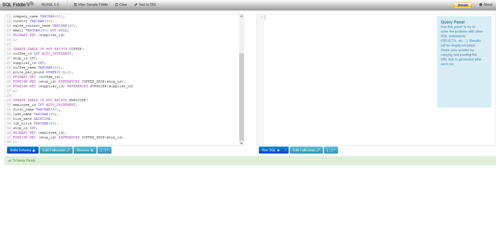
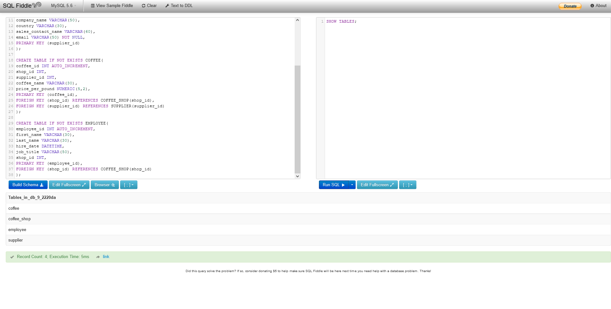
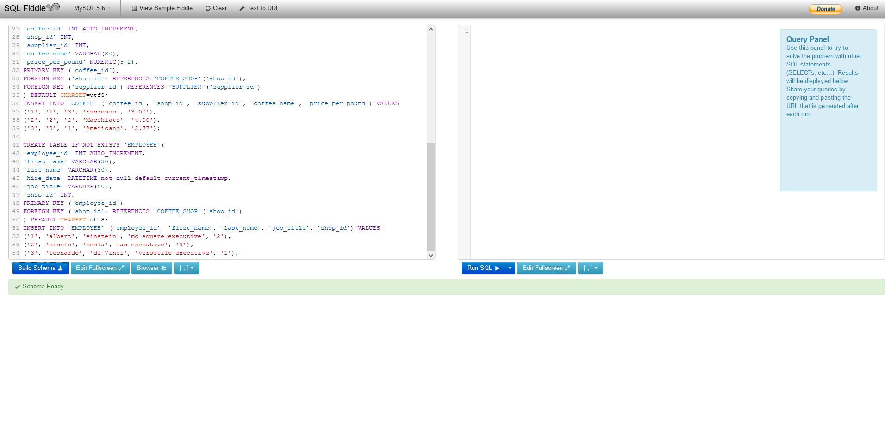
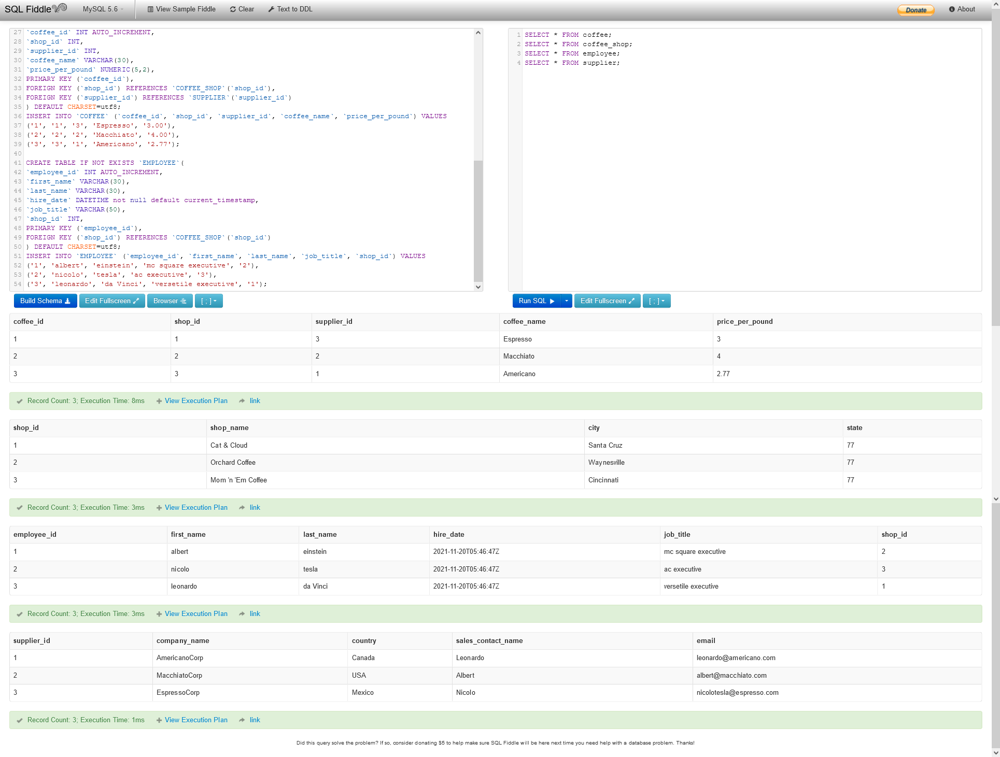
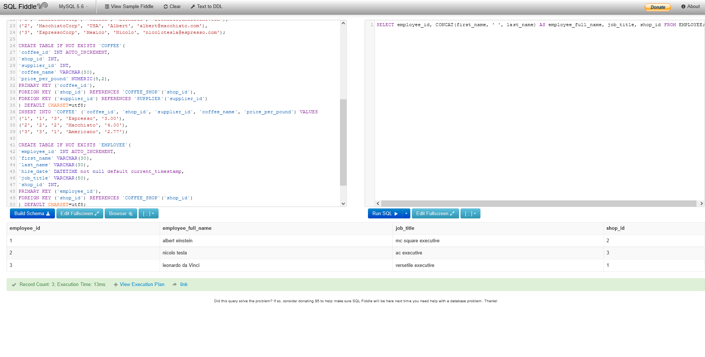
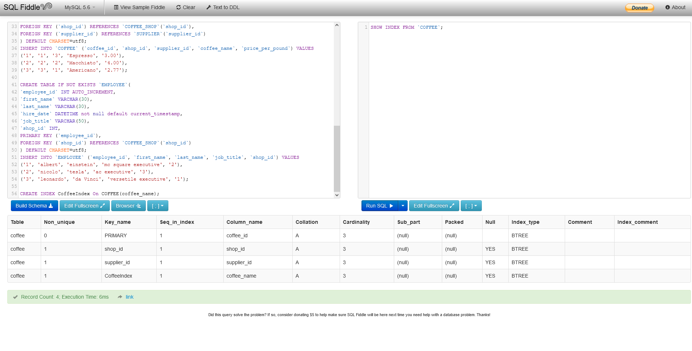
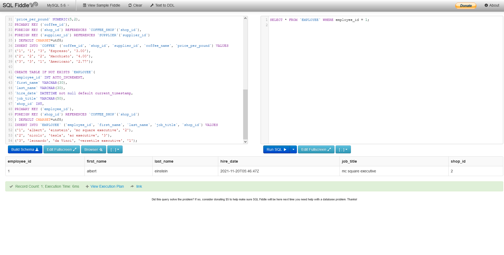
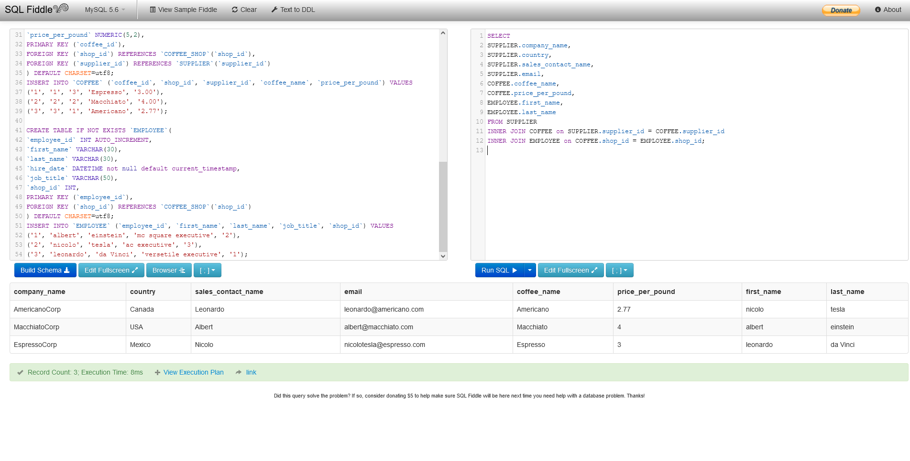

## A. Construct a normalized physical database model to represent the ordering process for Nora’s Bagel Bin by doing the following:
 <br>

### 1.  Complete the second normal form (2NF) section of the attached “Nora’s Bagel Bin Database Blueprints” document by doing the following:
a.  Assign each attribute from the 1NF table into the correct 2NF table.
b.  Describe the relationship between the two pairs of 2NF tables by indicating their cardinality in each of the dotted cells: one-to-one (1:1),
one-to-many (1:M), many-to-one (M:1), or many-to-many (M:M).
Note: Cardinality is read left to right and top to bottom, and the preferred method of notation is crow's foot. 
c.  Explain how you assigned attributes to the 2NF tables and determined the cardinality of the relationships between your 2NF tables.
### 2.  Complete the third normal form (3NF) section of the attached “Nora’s Bagel Bin Database Blueprints” document by doing the following:
a.  Assign each attribute from your 2NF "Bagel Order" table into one of the new 3NF tables. Copy all other information from your 2NF diagram
into the 3NF diagram.

b.  Provide each 3NF table with a name that reflects its contents.

c.  Create a new field that will be used as a key linking the two 3NF tables you named in part A2b. Ensure that your primary key (PK) and
foreign key (FK) fields are in the correct locations in the 3NF diagram.

d.  Describe the relationships between the 3NF tables by indicating their cardinality in each of the dotted cells: one-to-one (1:1), one-to-many
(1:M), many-to-one (M:1), or many-to-many (M:M).
Note: Cardinality is read left to right and top to bottom, and the preferred method of notation is crow's foot. 

e.  Explain how you assigned attributes to the 3NF tables and determined the cardinality of the relationships between your 3NF tables.
### 3.  Complete the "Final Physical Database Model" section of the attached “Nora’s Bagel Bin Database Blueprints” document by doing the following:
<br>
a.  Copy the table names and cardinality information from your 3NF diagram into the “Final Physical Database Model” and rename the
attributes.

b.  Assign one of the following five data types to each attribute in your 3NF tables: CHAR(), VARCHAR(), TIMESTAMP, INTEGER, or
NUMERIC(). Each data type must be used at least once.

### <a href="./assets/Nora's Bagel Bin Database BlueprintsWorking.odt" target="_top">Download Nora's Bagel Bin Database BlueprintsWorking.odt</a> <br> or <br> <a href="./assets/Nora's Bagel Bin Database BlueprintsWorking.docx" target="_top">Download Nora's Bagel Bin Database BlueprintsWorking.docx</a>


<br>

## B. Create a database using the attached "Jaunty Coffee Co. ERD" by doing the following:

### => 1.  Develop SQL code to create each table as specified in the attached “Jaunty Coffee Co. ERD” by doing the following:

a.  Provide the SQL code you wrote to create all the tables.

b.  Demonstrate that you tested your code by providing a screenshot showing your SQL commands and the database server’s response.

### # The SQL Command:
```sql
CREATE TABLE IF NOT EXISTS COFFEE_SHOP(
shop_id INT AUTO_INCREMENT,
shop_name VARCHAR(50),
city VARCHAR(50),
state CHAR(2),
PRIMARY KEY (shop_id)
);

CREATE TABLE IF NOT EXISTS SUPPLIER(
supplier_id INT AUTO_INCREMENT,
company_name VARCHAR(50),
country VARCHAR(30),
sales_contact_name VARCHAR(60),
email VARCHAR(50) NOT NULL,
PRIMARY KEY (supplier_id)
);

CREATE TABLE IF NOT EXISTS COFFEE(
coffee_id INT AUTO_INCREMENT,
shop_id INT,
supplier_id INT,
coffee_name VARCHAR(30),
price_per_pound NUMERIC(5,2),
PRIMARY KEY (coffee_id),
FOREIGN KEY (shop_id) REFERENCES COFFEE_SHOP(shop_id),
FOREIGN KEY (supplier_id) REFERENCES SUPPLIER(supplier_id)
);

CREATE TABLE IF NOT EXISTS EMPLOYEE(
employee_id INT AUTO_INCREMENT,
first_name VARCHAR(30),
last_name VARCHAR(30),
hire_date DATETIME,
job_title VARCHAR(50),
shop_id INT,
PRIMARY KEY (employee_id),
FOREIGN KEY (shop_id) REFERENCES COFFEE_SHOP(shop_id)
);
```
### # Screenshot 1i:

### # Screenshot 1ii:


### => 2.  Develop SQL code to populate each table in the database design document by doing the following:
 
Note: This data is not provided. You will be fabricating the data for this step.

a.  Provide the SQL code you wrote to populate the tables with at least three rows of data in each table.

b.  Demonstrate that you tested your code by providing a screenshot showing your SQL commands and the database server’s response.

### # The SQL Command:
```sql
CREATE TABLE IF NOT EXISTS `COFFEE_SHOP` (
`shop_id` INT AUTO_INCREMENT,
`shop_name` VARCHAR(50),
`city` VARCHAR(50),
`state` CHAR(2),
PRIMARY KEY (`shop_id`)
) DEFAULT CHARSET=utf8;
INSERT INTO `COFFEE_SHOP` (`shop_id`, `shop_name`, `city`, `state`) VALUES
('1', 'Cat & Cloud', 'Santa Cruz','77'),
('2', 'Orchard Coffee', 'Waynesville','77'),
('3', 'Mom \'n \'Em Coffee', 'Cincinnati','77');

CREATE TABLE IF NOT EXISTS `SUPPLIER`(
`supplier_id` INT AUTO_INCREMENT,
`company_name` VARCHAR(50),
`country` VARCHAR(30),
`sales_contact_name` VARCHAR(60),
`email` VARCHAR(50) NOT NULL,
PRIMARY KEY (`supplier_id`)
) DEFAULT CHARSET=utf8;
INSERT INTO `SUPPLIER` (`supplier_id`, `company_name`, `country`, `sales_contact_name`, `email`) VALUES
('1', 'AmericanoCorp', 'Canada', 'Leonardo', 'leonardo@americano.com'),
('2', 'MacchiatoCorp', 'USA', 'Albert', 'albert@macchiato.com'),
('3', 'EspressoCorp', 'Mexico', 'Nicolo', 'nicolotesla@espresso.com');

CREATE TABLE IF NOT EXISTS `COFFEE`(
`coffee_id` INT AUTO_INCREMENT,
`shop_id` INT,
`supplier_id` INT,
`coffee_name` VARCHAR(30),
`price_per_pound` NUMERIC(5,2),
PRIMARY KEY (`coffee_id`),
FOREIGN KEY (`shop_id`) REFERENCES `COFFEE_SHOP`(`shop_id`),
FOREIGN KEY (`supplier_id`) REFERENCES `SUPPLIER`(`supplier_id`)
) DEFAULT CHARSET=utf8;
INSERT INTO `COFFEE` (`coffee_id`, `shop_id`, `supplier_id`, `coffee_name`, `price_per_pound`) VALUES
('1', '1', '3', 'Espresso', '3.00'),
('2', '2', '2', 'Macchiato', '4.00'),
('3', '3', '1', 'Americano', '2.77');

CREATE TABLE IF NOT EXISTS `EMPLOYEE`(
`employee_id` INT AUTO_INCREMENT,
`first_name` VARCHAR(30),
`last_name` VARCHAR(30),
`hire_date` DATETIME not null default current_timestamp,
`job_title` VARCHAR(50),
`shop_id` INT,
PRIMARY KEY (`employee_id`),
FOREIGN KEY (`shop_id`) REFERENCES `COFFEE_SHOP`(`shop_id`)
) DEFAULT CHARSET=utf8;
INSERT INTO `EMPLOYEE` (`employee_id`, `first_name`, `last_name`, `job_title`, `shop_id`) VALUES
('1', 'albert', 'einstein', 'mc square executive', '2'),
('2', 'nicolo', 'tesla', 'ac executive', '3'),
('3', 'leonardo', 'da Vinci', 'versetile executive', '1');
```


### # Screenshot 2i:

### After Successful Build, run this on the right side
```sql
SELECT * FROM coffee;
SELECT * FROM coffee_shop;
SELECT * FROM employee;
SELECT * FROM supplier;
```
### # Screenshot 2ii:



### 3.  Develop SQL code to create a view by doing the following: 

a.  Provide the SQL code you wrote to create your view. The view should show all of the information from the “Employee” table but concatenate each employee’s first and last name, formatted with a space between the first and last name, into a new attribute called employee_full_name.

### # The SQL Command:
```sql
SELECT employee_id, CONCAT(first_name, ' ', last_name) AS employee_full_name, job_title, shop_id FROM EMPLOYEE;
```
### # Screenshot 3:



### 4.  Develop SQL code to create an index on the coffee_name field by doing the following:

a.  Provide the SQL code you wrote to create your index on the coffee_name field from the “Coffee” table.

b.  Demonstrate that you tested your code by providing a screenshot showing your SQL commands and the database server’s response.

### # The SQL Command:
```sql
CREATE INDEX CoffeeIndex On COFFEE(coffee_name);
SHOW INDEX FROM `COFFEE`;
```

### # Screenshot 4:


### 5.  Develop SQL code to create an SFW (SELECT–FROM–WHERE) query for any of your tables or views by doing the following: 

a.  Provide the SQL code you wrote to create your SFW query.

b.  Demonstrate that you tested your code by providing a screenshot showing your SQL commands and the database server’s response.

### # The SQL Command:
```sql
SELECT * FROM `EMPLOYEE` WHERE employee_id = 1;
```

### # Screenshot 5:


### 6.  Develop SQL code to create a query by doing the following:

a.  Provide the SQL code you wrote to create your table joins query. The query should join together three different tables and include
attributes from all three tables in its output.

b.  Demonstrate that you tested your code by providing a screenshot showing your SQL commands and the database server’s response.

### # The SQL Command:
```sql
SELECT
SUPPLIER.company_name,
SUPPLIER.country,
SUPPLIER.sales_contact_name,
SUPPLIER.email,
COFFEE.coffee_name,
COFFEE.price_per_pound,
EMPLOYEE.first_name,
EMPLOYEE.last_name
FROM SUPPLIER
INNER JOIN COFFEE on SUPPLIER.supplier_id = COFFEE.supplier_id
INNER JOIN EMPLOYEE on COFFEE.shop_id = EMPLOYEE.shop_id;
```
### # Screenshot 6:



C.  Submit parts A and B as a PDF, with each part clearly labeled.
 
D.  Demonstrate professional communication in the content and presentation of your submission
___
NOTE: Commands to create inner join
```sql
SELECT TABLE1.column_name, TABLE2.column_name, TABLE3.column_name
FROM table1
INNER JOIN table2 ON table1.column_name = table2.column_name
INNER JOIN table3 ON table2.column_name = table3.column_name;
``` 